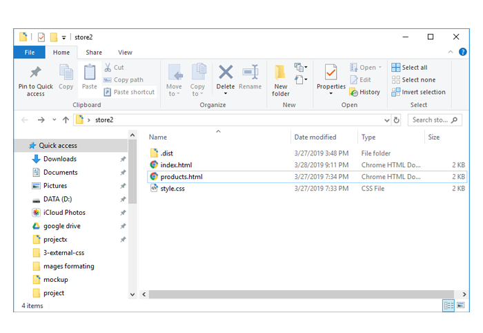

### مهمة اليوم

في نهاية ورشة العمل السابقة قمنا بتنزيل ملفات مشروع واجهة المتجر، إذا لم تعد ملفات المشروع موجودة على جهازك فقوم بالعودة للدرس التالي وتحميلها.

<a href="https://coretabs.net/classroom/frontend/البدء-مع-لغة-تنسيقات-المواقع-css/إطلاق-المشروع-1/تحميل-ملفات-المشروع" class="task-btn">تحميل الملفات</a>

في حال كانت لديك ملفات المشروع على جهازك أو إنتهيت من تحميلها فستقوم **بالمهمة التالية:**

### قمنا في ورشة العمل السابقة بعمل صفحتين:

- صفحة `index.html` والتي هي الصفحة الرئيسية.
- صفحة `products.html` والتي هي صفحة المزيد من المنتجات.

وكما تعرف قمنا في كل صفحة بكتابة التنسيقات بداخل العنصر `style` في منطقة الـ `head`، أي أننا قمنا بكتابة التنسيقات مرتين.

### ماهو المطلوب منك؟

ستقوم بنقل التنسيقات إلى ملف منفصل بإسم `style.css` ومن ثم تقوم بربط هذا الملف بكلا الصفحتين.

### يجب أن تقوم بتسليم التالي:

**1- صورة لمجلد المشروع** 

كالصورة التالية مثلاً
 

**2- أكواد صفحة index.html فقط**

يجب أن تتأكد بأنه مايزال يتم تطبيق تلك التنسيقات على الصفحات من خلال فتحها في المتصفح والإطلاع عليها.

### أين ستقوم بالتسليم؟

من خلال الرابط التالي

<a href="https://forums.coretabs.net/t/مشاركة-حلول-مهمة-صفحة-تنسيقات-خارجية/1579" class="task-btn">تسليم حلول المهمة</a>

في حال واجهتك أي مشكلة قم بإخبارنا حتى نساعدك.