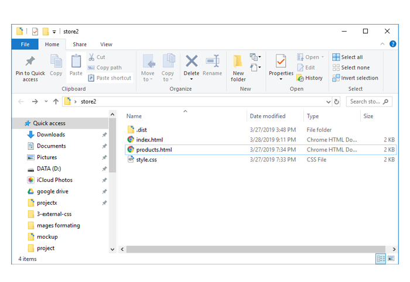

في [المهمة السابقة](https://coretabs.net/classroom/frontend/الإنتقال-لبيئة-العمل-المحلية/مشروعك-الأول-محليا/مهمة-ملف-تنسيقات-خارجي) قمت بفصل التنسيقات إلى ملف خارجي ومن ثم قمت بربط صفحات الويب بذلك الملف.

**في النهاية يجب أن يبدو ملف المشروع الخاص بك بهذا الشكل:**

 

### مهمة اليوم:
ستقوم في هذه المهمة بتقسيم ملفات المشروع بالهيكلة التي إتفقنا عليها خلال[الدرس السابق](https://coretabs.net/classroom/frontend/الإنتقال-لبيئة-العمل-المحلية/مشروعك-الأول-محليا/هيكلة-مجلد-المشروع).

### ما الذي يجب عليك أن تقوم بتسليمة؟
ستقوم بعمل صورة لملف المشروع بعد التقسيم الجديد ومشاركتها في منصة المجتمع من خلال الرابط التالي:

<a href="https://forums.coretabs.net/t/مشاركة-حلول-مهمة-هيكلة-مجلد-المشروع/1622" class="task-btn">تسليم الحلول</a>